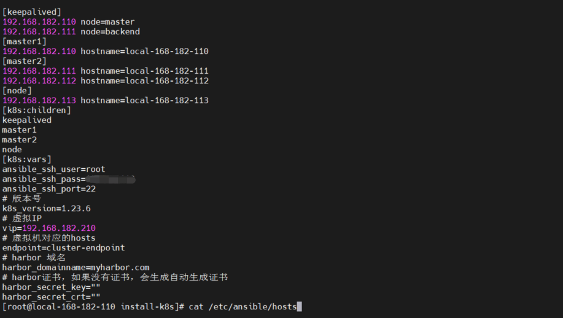
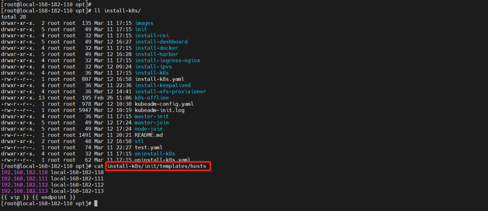
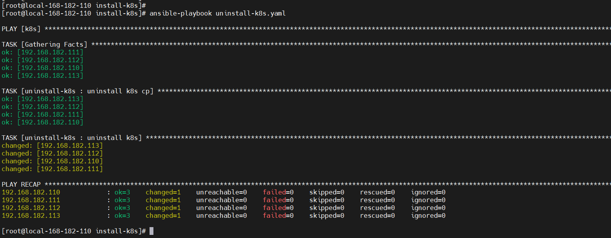

## k8s 一键部署

这里只是简单的讲解快速部署的步骤，细节讲解，可以参考我之前的文章：[【云原生】k8s 一键部署（ansible）](https://mp.weixin.qq.com/s?__biz=MzI3MDM5NjgwNg==&mid=2247486749&idx=1&sn=14949d4e9b4e7246bdb3157cadd74bbd&chksm=ead0f1f4dda778e27232369bf3392e4eb0cb400fe8074cc9a29339eed30e6ca487af28edb369#rd)

### 1）基于ansible 一键部署k8s流程图


### 2）安装ansible
```bash
yum -y install epel-release
yum -y install ansible
ansible --version
```

开启记录日志：
配置文件：`/etc/ansible/ansible.cfg`

```bash
vi /etc/ansible/ansible.cfg  
# 去掉前面的'#'号
#log_path = /var/log/ansible.log ==> log_path = /var/log/ansible.log
```

去掉第一次连接ssh ask确认

```bash
vi /etc/ansible/ansible.cfg  
# 其实就是把#去掉
# host_key_checking = False  ==> host_key_checking = False
```

### 3）下载
```bash
git clone https://gitee.com/hadoop-bigdata/install-k8s.git
```

### 4）修改配置

#### 1、修改节点信息，配置文件：/etc/ansible/hosts

```bash
[keepalived]
192.168.182.110 node=master
192.168.182.111 node=backend
[master1]
192.168.182.110 hostname=local-168-182-110
[master2]
192.168.182.111 hostname=local-168-182-111
192.168.182.112 hostname=local-168-182-112
[node]
192.168.182.113 hostname=local-168-182-113
[k8s:children]
keepalived
master1
master2
node
[k8s:vars]
ansible_ssh_user=root
ansible_ssh_pass=xxxxxx
ansible_ssh_port=22
# 版本号
k8s_version=1.23.6
# 虚拟IP，需修改成自己的定义的
vip=192.168.182.210
# 虚拟机对应的hosts
endpoint=cluster-endpoint
# harbor 域名
harbor_domainname=myharbor.com
# harbor证书，如果没有证书，会生成自动生成证书
harbor_secret_key=""
harbor_secret_crt=""
```

#### 2、修改 install-k8s/init/templates/hosts

```bash
# 修改成自己的节点
[root@local-168-182-110 opt]# cat install-k8s/init/templates/hosts
192.168.182.110 local-168-182-110
192.168.182.111 local-168-182-111
192.168.182.112 local-168-182-112
192.168.182.113 local-168-182-113
{{ vip }} {{ endpoint }}
```

### 5）导镜像
通过关注公众号【**大数据与云原生技术分享**】回复【`k8s`】即可获取k8s镜像包。也支持在线安装，但是建议是提前导入镜像，这样会节省大量安装时间。

### 5）执行部署
```bash
# 可以加上-vvv显示更多信息
ansible-playbook install-k8s.yaml
kubectl get nodes
kubectl get pods -A
kubectl top nodes
kubectl top pods -A
```


### 6）卸载
```bash
ansible-playbook uninstall-k8s.yaml
```


【温馨提示】

- 现在只支持`<v1.24`版本，后续会兼容高版本。
- 如果执行安装时卡住或者直接安装失败，可以再安装（可支持重复执行安装），也可以卸载重新安装。

有任何疑问欢迎留言或私信，欢迎关注我的公众号【大数据与云原生技术分享】深入交流技术或私信咨询问题哦~
